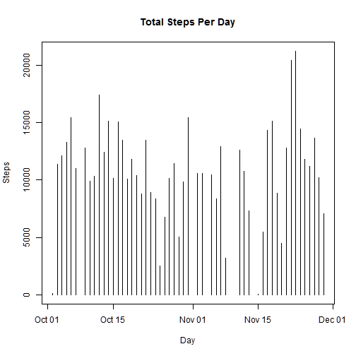
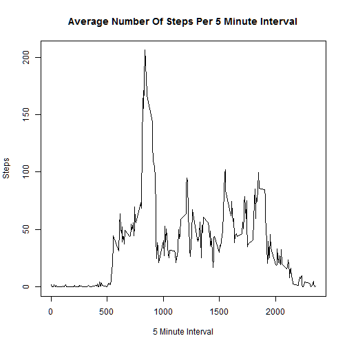
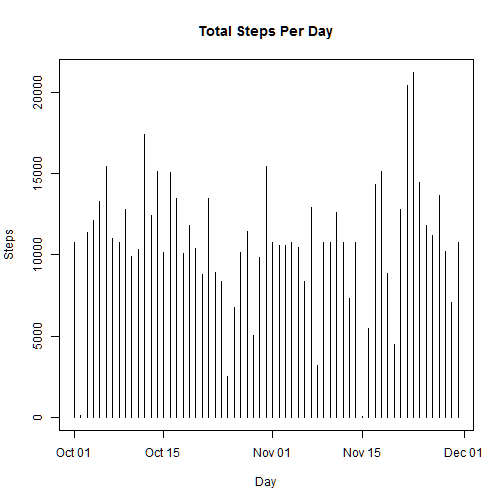
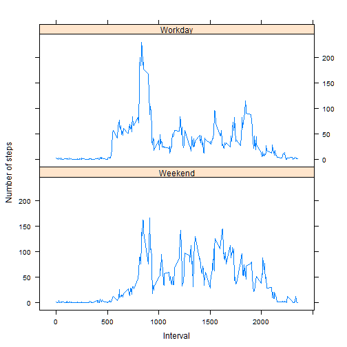

# Reproducible Research: - Peer Assignment 1

The given data from [Activity monitoring data](https://d396qusza40orc.cloudfront.net/repdata%2Fdata%2Factivity.zip) will be processed. The assignment is to answer a couple of questions.

Manually download the data, place the file in the current working directory and follow the following steps to reproduce.

## Loading and preprocessing the data
 - Load the data with:

```r
unzip("activity.zip")
act <- read.csv("activity.csv")                              # read the data from file 'activity.csv'
```
 - Transform the date string to a date in the data frame with:

```r
act$date <- as.Date(act$date, format="%Y-%m-%d")             # transform the date column into a type date
```


## What is mean total number of steps taken per day?
 - First we ignore any data with missing values (NA's) and produce a new data set called act_clean and then calculate the total number of steps taken per day.

```r
act_clean <- na.omit(act)                                    # remove NA's
steps <- aggregate(steps~date, data=act_clean, FUN=sum)      # sum steps per date
```

 - This will be the histogram for the steps over the given dates:

 

 - The mean and median number of steps taken per day is:

```r
mean(steps$steps)                                         # The mean of all steps.
```

```
## [1] 10766.19
```

```r
median(steps$steps)                                       # The median of all steps.
```

```
## [1] 10765
```


## What is the average daily activity pattern?
 - The time series plot of the 5-minute interval and the average number of steps taken, averaged accross all days:
 

 - The maximum number of steps is in interval.

```r
daily[which.max(daily$steps),1]                           # The interval with maximum of steps taken.
```

```
## [1] 835
```

That means over all days at 8:35 o'clock most of the steps are taken.

## Imputing missing values
 - The total number of missing values in the original dataframe is:

```r
sum(!complete.cases(act))                                 # Calculate the total number of missing values.
```

```
## [1] 2304
```

 - To fill the missing values in the dataframe the approach is to use the mean of amount of steps taken per interval throughout all days.

 - The new data set 'act.new' will be created by applying the following steps:

```r
act.na <- act[is.na(act$steps),]                                                # create an 'na' data set which NA observations
mean <- aggregate(steps ~ interval, act, FUN = "mean", rm.na=F)                 # create the average of steps along the interval
act.m <- merge(mean, act.na, by="interval")                                     # merge the means with the 'na' data set
names(act.m)[2] <- "steps"                                                      # rename the column 'steps.x' to 'steps'
act.new <- rbind(act[!is.na(act$steps),],act.m[c("date", "steps", "interval")]) # create the new data set
```

 - This will be the histogram for the steps over the given dates:

 

 - The mean and median number of steps taken per day is:

```r
mean(steps.new$steps)                                     # The mean of all steps.  
```

```
## [1] 10766.19
```

```r
median(steps.new$steps)                                   # The median of all steps.
```

```
## [1] 10766.19
```
Only the median differs to the original data set with missing values, the mean is the same.
The impact of imputing missing data on the estimate of the total daily number of steps is that all days have data, the histogramis more dense.

## Are there differences in activity patterns between weekdays and weekends?
 - The function `weekdays` is now used to enhance the data with an additional variable called *weekday* which flags a day either as workday or weekday.

```r
act.new$date <- as.Date(act.new$date, format="%Y-%m-%d")                      # transform the date string into a date type
weekday <- function(x) {                                                      # define the function weekdays   
  ifelse(!(weekdays(x) %in% c("Sunday", "Saturday")),"Workday","Weekend")
  }
act.new$weekday <- sapply(act.new$date, FUN = weekday)                        # add the column weekday                                            
act.new$weekday <- as.factor(act.new$weekday)                                 # transform the new column into a factor type
```

 - The panel plot blow now confronts the activity pattern on workdays with weekdays. On each panel it shows the average steps taken throughout the measured 5 minute intervals (5 o'clock appears as 500, 10 o'clock as 1000). It shows that there is a morning rush (possibly to work?) on weekdays, a mostly calm activity throughout the day and a small peak around 7 pm (possibly going home). On weekends the activity is more balanced throughout the day and it starts slightly later around 7 am but lats longer till after 8 pm.


```r
library(lattice)                                                              # need to load the library for lattice plotting
# average aggregation over interval and week
steps.new <- aggregate(. ~ interval + weekday, data = act.new, FUN = "mean")[c("interval","weekday","steps")]
# plotting the nubmer of steps over the intervals on workdays and weekends
xyplot(steps~interval|weekday, steps.new, type="l", xlab="Interval", ylab="Number of steps", layout=c(1,2))
```

 
